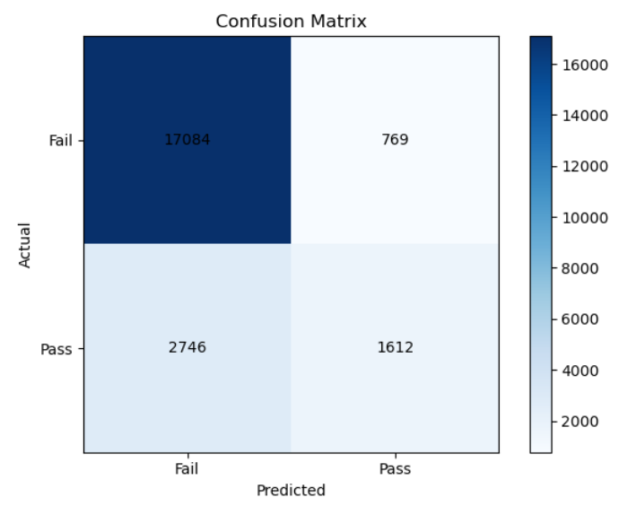
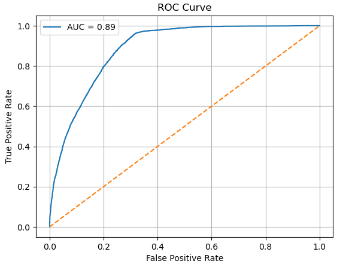

#  Restaurant Inspection Failure Prediction – NYC

## One Liner  
Built an interpretable ML system using **XGBoost** and **Random Forest** to predict restaurant inspection outcomes and help prevent food safety violations.

---

##  Project Overview

###  Objective  
To develop a non-trivial, actionable machine learning model that predicts whether a restaurant is likely to **pass or fail** a health inspection using historical NYC data. This model can assist health departments in prioritizing high-risk inspections and empower businesses to improve compliance.

### Why This Project Matters  
Foodborne illnesses are a major public health concern. When dining out, no one expects to face health issues—or worse, life-threatening consequences. By predicting inspection failures before they occur, this project contributes to:
- Safer food practices  
- Better resource allocation for inspectors  
- Stronger policy enforcement  

---

##  Key Modeling Choices & Justifications

- **Target Selection:**  
  I avoided using the `Inspection Score` due to its strong correlation with the final result (risk of label leakage). Instead, I selected `Inspection Result` and converted it into a binary `result` column:  
  - `Pass` = `Satisfactory`, `Complete`  
  - `Fail` = `Unsatisfactory`, `Incomplete`  

- **Data Cleaning:**  
  Removed irrelevant or leakage-prone columns like phone number, coordinates, and unique IDs. Also dropped missing values for quality control.

- **Temporal Feature Engineering:**  
  Extracted `year` and `month` from `Inspection Date` to capture trends such as seasonal policy enforcement or cyclical violations.

- **Violation Handling:**  
  Grouped `Violation Description` into the **Top 10 most common** categories plus “Other”, reducing noise from high-cardinality fields.

- **Categorical Encoding:**  
  Applied **one-hot encoding** to fields like `Violation Type` and `Inspection Type` to make them model-compatible without implying any ordering.

- **Class Filtering & Labeling:**  
  Focused on 4 inspection classes and created a new `result` column for binary classification. This made the model’s output easy to interpret for real-world applications.

- **Model Selection:**  
  I compared:
  - **Random Forest** as a baseline  
  - **XGBoost** with hyperparameter tuning  
  to assess performance vs. interpretability.



---

## ⚙ Tech Stack

- **Language:** Python  
- **Libraries:** pandas, numpy, scikit-learn, xgboost, matplotlib, seaborn, shap  
- **Hardware:** Local machine with 8GB RAM  
- **Training Time:** ~10 seconds

---

##  Results Summary

| **Metric**         | **Random Forest** | **XGBoost**     |
|--------------------|-------------------|-----------------|
| Accuracy           | **94.88%**        | 94.55%          |
| F1 Score           | **87.44%**        | 85.98%          |
| ROC AUC Score      | 98.25%            | **98.29%**      |

- **Random Forest** had stronger overall performance across most metrics.  
- **XGBoost** slightly outperformed in **class separation** based on ROC AUC.



---

##  Feature Importance Insights

I used both `feature_importances_` from Random Forest and **SHAP values** for XGBoost to understand what drove the predictions.

###  Top Influential Features:
- Violation Type  
- Grade  
- Inspection Type  
- Inspection Year  
- Violation Description

These features provide **explainability** and can guide inspection training, public health communication, or intervention strategy.

---

##  Real-World Impact

-  Helps inspectors focus on **high-risk businesses**  
-  Allows restaurant owners to **proactively fix** red flags  
-  Can be integrated into a **real-time dashboard** for city officials  
-  Promotes **data-driven food safety policies**

---
##  Future Work

Several enhancements can build on this project to increase its real-world utility:

- **Historical Features:**  
  Include past inspection history (e.g., previous failures, violation trends) for each restaurant to improve prediction accuracy.

- **Geospatial Insights:**  
  Use zip codes or boroughs to uncover regional risk patterns and hotspots.

- **API or Integration:**  
  Build a REST API to allow real-time predictions for internal dashboards or city-wide inspection tools.

##  Reproducibility

###  How to Run the Code

1. **Install Dependencies**

```bash
pip install pandas numpy matplotlib seaborn scikit-learn xgboost shap
