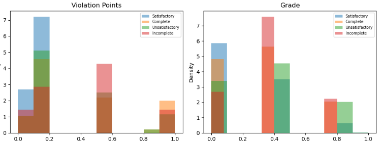

#  Restaurant Inspection Failure Prediction – NYC

**One Liner**: Built an interpretable ML system using XGBoost & Random Forest to predict restaurant inspection outcomes and help prevent food safety violations.

---

##  Project Overview

###  Objective
To develop a **non-trivial**, actionable machine learning model that predicts if a restaurant is likely to **pass or fail** a health inspection using historical NYC data. This model can assist health departments in **prioritizing high-risk inspections** and empower businesses to improve compliance.

###  Why This Project Matters
Foodborne illnesses are a major public health concern. When going to a restraunt to have a good time, one does not expect to have health concerns or even life threats. By predicting inspection failures before they happen, this project contributes to **safer food practices**, **resource allocation**, and **better policy enforcement**.

---

##  Key Modeling Choices & Justifications

* I started by selecting the prediction target. Rather than using the Inspection Score, which is often tightly correlated with the outcome and can lead to label leakage, I chose to predict the Inspection Result. This made the task more realistic by forcing the model to uncover meaningful patterns instead of relying on a trivial numerical link.

* Next, I performed data cleaning by removing irrelevant or potentially leakage-prone columns such as phone numbers and geographic coordinates. I also dropped records with missing values to ensure the quality of the dataset.

* To capture time-based trends, I extracted the year and month from the inspection date. This allowed the model to account for seasonal variations or policy shifts that might influence inspection outcomes.

* For the Violation Description feature, I grouped violations into the top 10 most frequent categories, combining the rest under an "Other" label. This reduced high-cardinality noise and helped the model focus on the most impactful violation types.

* I applied one-hot encoding to categorical variables like Violation Type and Inspection Type to convert them into a format suitable for machine learning. This avoids any incorrect assumptions of ordinal relationships among categories.

* To ensure label consistency, I first filtered the dataset to include only four interpretable inspection result classes: Satisfactory, Complete, Unsatisfactory, and Incomplete. These represent clear outcomes that can be grouped meaningfully. I then created a new binary column called '**result**', where inspections labeled as Satisfactory or Complete were marked as **Pass**, and those labeled Unsatisfactory or Incomplete were marked as **Fail**. This allowed me to frame the problem as a binary classification task, making the model output more interpretable and aligned with real-world decision-making (i.e., will a restaurant pass or fail its inspection?).

* Finally, I compared two models: a Random Forest as a baseline and an XGBoost model with hyperparameter tuning. This helped me assess the trade-offs between model performance, training time, and interpretability.

---



## Tech Stack

- **Language**: Python  
- **Libraries**: `pandas`, `numpy`, `scikit-learn`, `xgboost`, `matplotlib`, `seaborn`, `shap`  
- **Hardware**: Local machine with 8GB RAM  
- **Training Time**: ~10 seconds

---

##  Results Summary

| Metric            | Random Forest | XGBoost       |
|------------------|---------------|---------------|
| **Accuracy**      | **94.88%**    | 94.55%        |
| **F1 Score**      | **87.44%**    | 85.98%        |
| **ROC AUC Score** | 98.25%        | **98.29%**    |

-  **RF** had stronger overall classification performance  
-  **XGBoost** excelled in separating classes (ROC AUC)

  [im2](im2.png)


---

##  Feature Importance Insights

Used both `.feature_importances_` from RF and `SHAP` for model explainability:

- Key Drivers:  
  - `Violation Type`
  - `Grade`
  - `Inspection Type`
  - `Inspection Year`
  - `Violation Description`

These features help **explain what drives failure** and could guide training or resource allocation.

---

##  Real-World Impact

-  Helps inspectors **focus on at-risk businesses**
-  Allows restaurant owners to **predict and fix red flags** before failing
- Can be integrated into a **real-time dashboard** for the Department of Health

---

## Reproducibility

###  How to Run:

```bash
pip install pandas numpy matplotlib seaborn scikit-learn xgboost shap
