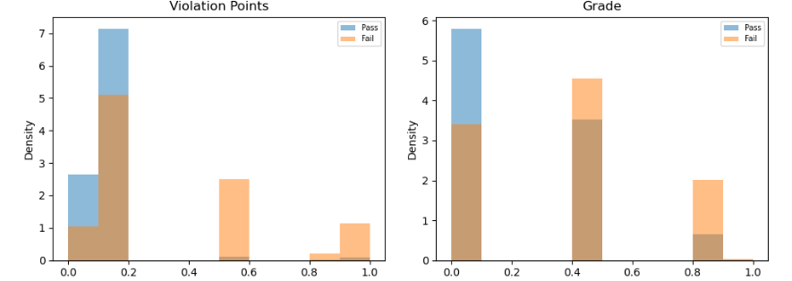

#  Restaurant Inspection Failure Prediction – NYC

## One Liner  
Built an interpretable ML system using **XGBoost** and **Random Forest** to predict restaurant inspection outcomes and help prevent food safety violations.

---

##  Project Overview

###  Objective  
To develop a non-trivial, actionable machine learning model that predicts whether a restaurant is likely to **pass or fail** a health inspection using historical NYC data. This model can assist health departments in prioritizing high-risk inspections and empower businesses to improve compliance.

### Why This Project Matters  
Foodborne illnesses are a major public health concern. When dining out, no one expects to face health issues—or worse, life-threatening consequences. By predicting inspection failures before they occur, this project contributes to:
- Safer food practices  
- Better resource allocation for inspectors  
- Stronger policy enforcement  

---

##  Key Modeling Choices 
- **Target Selection:**  
  I avoided using the `Inspection Score` due to its strong correlation with the final result (risk of label leakage). Instead, I selected `Inspection Result` and converted it into a binary `result` column:  
  - `Pass` = `Satisfactory`, `Complete`  
  - `Fail` = `Unsatisfactory`, `Incomplete`
 


Changed to --->




- **Data Cleaning:**  
  Removed irrelevant or leakage-prone columns like phone number, coordinates, and unique IDs. Also dropped missing values for quality control.

- **Temporal Feature Engineering:**  
  Extracted `year` and `month` from `Inspection Date` to capture trends such as seasonal policy enforcement or cyclical violations.

- **Violation Handling:**  
  Grouped `Violation Description` into the **Top 10 most common** categories plus “Other”, reducing noise from high-cardinality fields.

- **Categorical Encoding:**  
  Applied **one-hot encoding** to fields like `Violation Type` and `Inspection Type` to make them model-compatible without implying any ordering.

- **Class Filtering & Labeling:**  
  Focused on 4 inspection classes and created a new `result` column for binary classification. This made the model’s output easy to interpret for real-world applications.


---

##  Tools

- **Language:** Python  
- **Libraries:** pandas, numpy, scikit-learn, xgboost, matplotlib, seaborn, shap  
- **Hardware:** Local machine with 8GB RAM  
- **Training Time:** ~10 seconds

---

##  Results Summary

###  Random Forest
Random Forest showed strong overall performance, especially in terms of F1 Score, which is crucial in imbalanced classification problems like this. It’s a robust ensemble model that reduces overfitting by averaging multiple decision trees.

- Robust to overfitting and noise  
- Automatically handles feature interactions  
-  Interpretable via `feature_importances_`  
-  Recommended for use in early deployment phases or when high interpretability is desired  


---

###  XGBoost (Tuned)

XGBoost slightly outperformed all models in **ROC AUC**, indicating it best separates “Pass” from “Fail”. It uses gradient boosting and regularization, making it powerful and efficient.

-  High AUC and precision with hyperparameter tuning  
-  Handles missing data and sparse features  
-  SHAP values provide advanced model interpretability  
-  Ideal for production systems prioritizing predictive power  

---


###  Decision Tree

The simplest model in our pipeline, Decision Tree offers full transparency in how decisions are made. It’s less accurate than ensemble methods but great for visual explanation.

-  Fully interpretable structure  
-  Quick to train  
-  Prone to overfitting without pruning  
-  Suitable for stakeholder presentations and small-scale rule systems  

---

###  Logistic Regression

As a baseline, Logistic Regression performed surprisingly well, given its linear nature. It’s a fast, efficient model that outputs interpretable coefficients, useful for understanding linear feature impacts.

-  Very fast to train and test  
-  Coefficients explain feature impact directionally  
-  Limited in capturing complex patterns or feature interactions  
-  Great for quick prototyping or lightweight apps  
---


###  Final Model Comparison Takeaway

- **XGBoost**: Best for separation and generalization  
- **Random Forest**: Best balance of performance + explainability  
- **Decision Tree**: Best for visual interpretability  
- **Logistic Regression**: Best for speed and simplicity

---


##  Feature Importance Insights

I used both `feature_importances_` from Random Forest and **SHAP values** for XGBoost to understand what drove the predictions.

###  Top Influential Features:
- Violation Type  
- Grade  
- Inspection Type  
- Inspection Year  
- Violation Description

These features provide **explainability** and can guide inspection training, public health communication, or intervention strategy.

---

##  Real-World Impact

-  Helps inspectors focus on **high-risk businesses**  
-  Allows restaurant owners to **proactively fix** red flags  
-  Can be integrated into a **real-time dashboard** for city officials  
-  Promotes **data-driven food safety policies**

---
##  Future Work

Several enhancements can build on this project to increase its real-world utility:

- **Historical Features:**  
  Include past inspection history (e.g., previous failures, violation trends) for each restaurant to improve prediction accuracy.

- **Geospatial Insights:**  
  Use zip codes or boroughs to uncover regional risk patterns and hotspots.

- **API or Integration:**  
  Build a REST API to allow real-time predictions for internal dashboards or city-wide inspection tools.

##  Reproducibility

###  How to Run the Code

1. **Install Dependencies**

```bash
pip install pandas numpy matplotlib seaborn scikit-learn xgboost shap
